# slipway-agents

> PRD-to-engineering-docs pipeline agents for [OpenCode](https://opencode.ai).

slipway-agents takes a raw product idea or existing PRD and drives it through a structured, multi-agent pipeline — brainstorm → engineering docs → cross-doc review → sprint grooming → phased planning. One orchestrator (`slipway`) coordinates seven specialized subagents. It also handles extending an existing project when a new feature arrives, and syncing docs back to reality after implementation.

---

## How it works



<details>
<summary>Pipeline stages</summary>

| Stage | Agent | What happens |
|---|---|---|
| **Input** | `slipway` | Detects mode: bootstrap from prompt, bootstrap from PRD, extend, or sync |
| **PRD** | `drafting-table` | Structured Q&A → complete `01-prd.md` (8 required sections, gap-fill loop) |
| **Docs** | `hull-builder` | Invokes `bootstrap-from-prd` skill → docs `02`–`10` + `AGENT.md` |
| **Review** | `inspector` | Cross-doc validation, severity-ranked findings, health score 0–100 |
| **Review** | optimize loop | Up to 2 cycles to resolve Critical findings before planning |
| **Plan** | `groomer` | Lead Dev + QA + DevOps readiness signals — blocks planning if Blocked |
| **Plan** | `rigger` | Phase/milestone breakdown → `.ai/planning/` with tasks, owners, AC, FR trace |
| **Build** | Sisyphus / omo.dev | Implements based on `AGENT.md` + planning docs |
| **Extend** | `shipwright` | New feature arrives → scoped PRD update + targeted doc rebuild |
| **Sync** | `chronicler` | Post-build drift detection → incremental doc updates + changelog entry |

</details>

---

## Agents

| Agent | Role | Model |
|---|---|---|
| `slipway` | Orchestrator — routes pipeline, enforces step order, never generates content | `claude-opus-4-6` |
| `drafting-table` | Raw prompt / partial PRD → complete `.ai/docs/01-prd.md` | `claude-sonnet-4-6` |
| `hull-builder` | Invokes `bootstrap-from-prd` skill → docs 02–10 + `AGENT.md` | `claude-sonnet-4-6` |
| `inspector` | Cross-doc validation + severity-ranked findings + health score | `claude-sonnet-4-6` |
| `groomer` | Sprint grooming — Lead Dev, QA, DevOps lenses | `claude-sonnet-4-6` |
| `rigger` | Phase/milestone breakdown → `.ai/planning/` | `claude-sonnet-4-6` |
| `shipwright` | Extend existing docs when a new feature is introduced | `claude-sonnet-4-6` |
| `chronicler` | Post-implementation doc sync — detect drift, patch docs incrementally | `claude-haiku-4-5` |

Model assignments live in [`slipway.json`](./slipway.json) and can be overridden per-environment.

---

## Skills

| Skill | Used by | Purpose |
|---|---|---|
| `bootstrap-from-prd` | `hull-builder` | Generates the full 02–10 doc suite + `AGENT.md` from a PRD |
| `groomer-lead-dev` | `groomer` | Lead Dev lens — architecture, implementation risk, tech debt |
| `groomer-qa` | `groomer` | QA lens — testability, edge cases, acceptance criteria gaps |
| `groomer-devops` | `groomer` | DevOps/Cloud lens — infra, deployment, observability readiness |

---

## What gets generated

A single pipeline run from a raw idea produces:

```
.ai/
├── docs/
│   ├── 01-prd.md                          ← product requirements (drafting-table)
│   ├── 02-technical-architecture.md        ┐
│   ├── 03-service-boundaries.md            │
│   ├── 04-data-models.md                   │
│   ├── 05-api-specifications.md            ├─ hull-builder via bootstrap-from-prd skill
│   ├── 06-operational-flows.md             │
│   ├── 07-engineering-standards.md         │
│   ├── 08-architecture-decisions.md        │
│   ├── 09-topology-diagrams.md             │
│   ├── 10-planning-rules.md               ┘
│   ├── .pipeline-state.md                 ← resume state across sessions
│   └── .pipeline-changelog.md             ← audit trail of every pipeline run
├── planning/
│   ├── 00-overview.md                     ┐
│   ├── 01-phase-*.md                      ├─ rigger
│   └── ...                               ┘
└── AGENT.md                               ← implementation instructions for Sisyphus
```

---

## Install

**Quick install — let an agent do it:**

```
Install and configure slipway-agents by following the instructions here:
https://raw.githubusercontent.com/fresp/slipway-agents/refs/heads/main/docs/guide/installation.md
```

**Manual install:**

```bash
git clone https://github.com/fresp/slipway-agents ~/.config/opencode/agents/slipway-agents
```

Add to `opencode.json`:

```json
{
  "agents": {
    "include": ["~/.config/opencode/agents/slipway-agents"]
  }
}
```

Full guide: [docs/guide/installation.md](./docs/guide/installation.md)

---

## Usage

```
# From a raw idea
@slipway I want to build [your idea]

# From an existing PRD
@slipway bootstrap from .ai/docs/01-prd.md

# Add a new feature to an existing project
@slipway ada fitur baru: [feature description]

# Review docs without running the full pipeline
@slipway review

# Sync docs after implementation
@slipway sync docs
```

slipway walks you through each step with a `yes / no` prompt — you never need to remember which subagent to call next. State is persisted to `.ai/docs/.pipeline-state.md` so interrupted runs resume from the last completed step.

---

## Overriding models

Copy `slipway.json` and point to your provider:

```jsonc
// slipway.local.json
{
  "$schema": "https://raw.githubusercontent.com/fresp/slipway-agents/refs/heads/main/slipway.schema.json",
  "version": "1.0.0",
  "agents": {
    "slipway":        { "model": "amazon-bedrock/us.anthropic.claude-opus-4-6" },
    "drafting-table": { "model": "amazon-bedrock/us.anthropic.claude-sonnet-4-6" },
    "hull-builder":   { "model": "amazon-bedrock/us.anthropic.claude-sonnet-4-6" },
    "inspector":      { "model": "amazon-bedrock/us.anthropic.claude-sonnet-4-6" },
    "groomer":        { "model": "amazon-bedrock/us.anthropic.claude-sonnet-4-6" },
    "rigger":         { "model": "amazon-bedrock/us.anthropic.claude-sonnet-4-6" },
    "shipwright":     { "model": "amazon-bedrock/us.anthropic.claude-sonnet-4-6" },
    "chronicler":     { "model": "amazon-bedrock/us.anthropic.claude-haiku-4-5" }
  }
}
```

See [installation guide](./docs/guide/installation.md) for all supported providers.

---

## Examples

- [`skills/slipway/bootstrap-from-prd/examples/managed-waba/`](./skills/slipway/bootstrap-from-prd/examples/managed-waba/) — full pipeline output for a multi-tenant WhatsApp Business Calling service (Kamailio → Asterisk → WebRTC, MongoDB + Redis, multi-tenant SIP gateway)

---

## License

MIT
