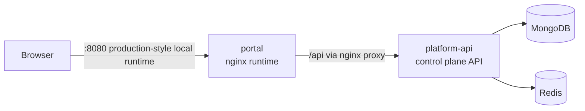

# Managed WABA Platform Topology & Architecture Diagrams

Version: 1.2

Status: Frozen

---

# 1. High Level Architecture

The platform is divided into two planes.

                +----------------+
                |     Portal     |
                | React + Vite   |
                +--------+-------+
                         |
                         |
                         v
                +----------------+
                |  platform-api  |
                | Control Plane  |
                +--------+-------+
                         |
            +------------+------------+
            |                         |
            v                         v
      Meta Embedded Signup        MongoDB

=================================================

             External Client Systems
                         |
                         |
                         v
                +----------------+
                |    meta-api    |
                |   Data Plane   |
                +--------+-------+
                         |
           +-------------+-------------+
           |                           |
           v                           v
    Meta Graph API                 RabbitMQ
                                           |
                                           |
                            +--------------+--------------+
                            |                             |
                            v                             v
                  webhook-worker                 retry-worker
                            |
                            |
                            v
                Customer Webhook Endpoint

---

# 2. Plane Separation

## Control Plane
portal, platform-api
Responsibilities: Dashboard, Authentication, Embedded Signup, WABA Sync, Phone Number Sync, Access Token Management, Webhook Configuration, Dashboard Metrics, Audit Logs, Settings.

## Data Plane
meta-api, webhook-worker, retry-worker
Responsibilities: Runtime Meta APIs, Webhook Processing, Webhook Delivery, Retry Mechanism.

---

# 3. Logical Deployment Topology

┌──────────────────────────────────┐
│            Frontend              │
│            portal                │
└──────────────────────────────────┘
┌──────────────────────────────────┐
│          Control Plane           │
│         platform-api             │
└──────────────────────────────────┘
┌──────────────────────────────────┐
│           Data Plane             │
│           meta-api               │
│        webhook-worker            │
│         retry-worker             │
└──────────────────────────────────┘
┌──────────────────────────────────┐
│      Shared Infrastructure       │
│ MongoDB, Redis, RabbitMQ         │
└──────────────────────────────────┘
┌──────────────────────────────────┐
│       External Services          │
│ Meta Graph API, Webhooks, Client │
└──────────────────────────────────┘

---

# 4. Sequence Diagram - Embedded Signup

Portal -> platform-api -> Launch Embedded Signup -> Meta -> Success Callback -> platform-api -> Sync WABAs & Phone Numbers -> Persist Metadata -> MongoDB -> Portal
Rules: Auto sync, No manual sync.

---

# 5. Sequence Diagram - Outbound Messaging

External Client -> Authorization: Bearer {access_token} -> meta-api -> Validate Token & Resolve Phone -> Forward Request -> Meta Graph API -> Meta Response -> meta-api -> Persist Metadata -> Return Response -> External Client
Rules: Preserve request body, headers, query params, response. Persist metadata only.

---

# 6. Sequence Diagram - Inbound Webhook

Meta -> POST /webhooks/meta -> meta-api -> Persist webhook_events -> Publish RabbitMQ -> cloudwa.events -> webhook-worker
Rules: Preserve payload, Async forwarding only, No business processing.

---

# 7. Sequence Diagram - Webhook Delivery

webhook-worker -> Resolve Webhook Config -> Generate Signature -> POST Customer Endpoint -> Customer Endpoint -> HTTP Response -> webhook-worker -> Persist Delivery Result -> Success? (Yes -> Stop, No -> Publish Retry Event)
Header: X-CLOUDWA-SIGNATURE

---

# 8. Sequence Diagram - Retry Flow

webhook-worker -> Publish Retry Event -> cloudwa.retry -> retry-worker -> Calculate Schedule -> Delay -> Republish -> cloudwa.events -> webhook-worker
Retry schedule: Immediate, 1m, 5m, 15m, 1h -> DLQ.

---

# 9. Sequence Diagram - meta-api Internal Runtime Flow

Request -> Validate Access Token -> Resolve Phone Number -> Forward To Meta -> Receive Meta Response -> Extract Metadata -> Persist Metadata -> Return Meta Response
Rules: Do not transform payload/response, Do not inject fields.

---

# 10. Sequence Diagram - meta-api Webhook Lifecycle

Meta Webhook -> Receive Payload -> Persist -> Publish Event -> 200 OK To Meta -> webhook-worker -> Customer Endpoint -> Success? (Yes -> Stop, No -> cloudwa.retry)
Rules: Meta acknowledgement must happen immediately. Never wait for customer endpoint response.

---

# 11. Communication Matrix

(Refer to section 6 of Technical Architecture document)

---

# 12. Local Container Topology (Current Repo Scope)

This section documents the current runnable container topology in this repository.
It does not replace the frozen target-state architecture above.

The currently containerized scope is limited to:
- portal
- platform-api
- mongodb
- redis

Notes:
- In the production portal image, `VITE_PLATFORM_API_URL` is built as an empty string so browser requests remain relative to `/api/...`.
- `services/portal/nginx.conf` proxies `/api/` to `http://platform-api:3000/api/` on the internal Compose network.
- `docker-compose.dev.yml` switches portal and platform-api into development mode with bind mounts and exposes the portal dev server on `:5173`.
- Host `27017` may need to be overridden through `CLOUDWA_MONGODB_HOST_PORT` if MongoDB is already running locally.

---

# 13. Sacred Rules

Control Plane and Data Plane must remain separated.
Only platform-api may own Embedded Signup.
Only meta-api may own runtime Meta traffic.
Workers must remain stateless.
Meta compatibility is mandatory.
Architecture diagrams are frozen.
