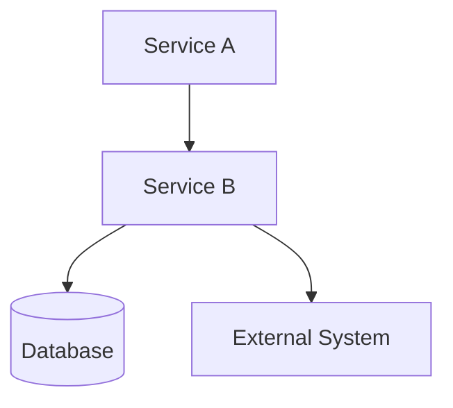
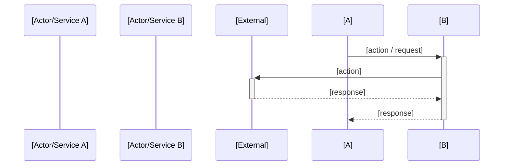

# [Project Name] Topology & Architecture Diagrams

Version: 1.0
Status: Frozen

---

# 1. High Level Architecture

[Use ASCII block diagram or Mermaid. Show all services and their primary connections.]

```
Example ASCII:
                +----------------+
                |   [Service A]  |
                +-------+--------+
                        |
                        v
                +----------------+
                |   [Service B]  |
                +-------+--------+
                        |
            +-----------+-----------+
            |                       |
            v                       v
     [External System]          [Database]
```

Or Mermaid:


---

# 2. [Control Plane / Data Plane separation — if applicable]

[Show the boundary between planes. Label which services belong to each.]

---

# 3. [Flow Name] — Sequence Diagram



<!-- Repeat for every major flow defined in 06-operational-flows.md -->

---

# 4. Infrastructure Topology

[Show queues, workers, caches, and databases and how they connect to services.]

```
[Service] --AMQP--> [Queue] --AMQP--> [Worker]
[Service] --Redis--> [Cache]
```

<!--
VALIDATION RULES:
- Every service in the diagram must exist in 02-technical-architecture.md
- Every flow diagram must correspond to a flow in 06-operational-flows.md
- Communication protocols shown must match 02-technical-architecture.md service communication table
- No diagram may show a service connection that is not permitted by 03-service-boundaries.md
-->
