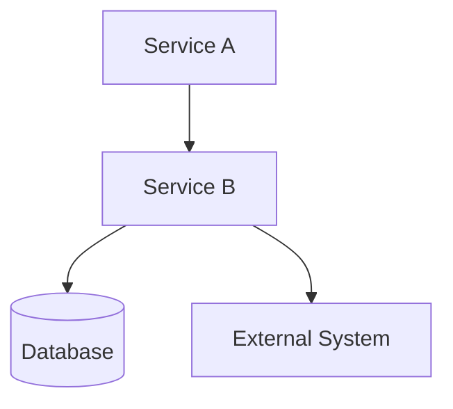

# docs-publish

Generate a Technical Requirements Document (TRD) for a specific feature with Mermaid diagrams.

The output is a self-contained markdown file at `/docs/<feature>/TRD.md` that documents the technical design, architecture decisions, and operational flows for a single feature scope.

---

## When to Use

Invoke this skill when:
- Implementation of a feature is complete and needs documentation
- User says "publish docs", "generate TRD", "create feature documentation"
- After `shipwright` completes a feature extension and documentation is ready
- After `chronicler` completes a post-implementation sync

Do NOT use when:
- Bootstrap a full project from scratch (use `bootstrap-from-prd`)
- Extend existing docs with a new feature (use `shipwright`)
- Sync docs after implementation (use `chronicler`)

---

## Core Principles

- TRD is a derived document — it does not introduce new architecture or requirements
- Every claim in the TRD must trace to an existing `.ai/docs/` document or implementation evidence
- Mermaid diagrams must follow the style in `09-topology-and-architecture-diagrams.md` template
- Scope is surgical — document exactly one feature, no more
- No new subagents — piggyback on existing agents for data gathering

---

## Input

**Required:**
```
.ai/docs/
├── 01-prd.md                          (or supplementary PRD for this feature)
├── 02-technical-architecture.md
├── 03-service-boundaries.md
├── 04-data-models.md
├── 05-api-specifications.md
├── 06-operational-flows.md
├── 07-engineering-standards.md
├── 08-architecture-decisions.md
├── 09-topology-and-architecture-diagrams.md
└── 10-planning-rules.md
```

**Feature scope identifier:**
- Feature name (e.g., "user-authentication", "payment-processing")
- FR-IDs associated with this feature (from `01-prd.md`)

---

## Modes

### Default (post-implementation)

Run when: feature implementation is complete and docs exist

1. Read all `.ai/docs/` documents to understand the full architecture
2. Identify which FR-IDs belong to this feature
3. Extract relevant sections from each doc:
   - Services involved (from `02-technical-architecture.md`)
   - Ownership boundaries (from `03-service-boundaries.md`)
   - Data models used (from `04-data-models.md`)
   - API endpoints (from `05-api-specifications.md`)
   - Operational flows (from `06-operational-flows.md`)
   - Architecture decisions (from `08-architecture-decisions.md`)
   - Existing diagrams (from `09-topology-and-architecture-diagrams.md`)
4. Generate `/docs/<feature>/TRD.md` with Mermaid diagrams

### With implementation evidence

Run when: implementation files are available for cross-reference

Same as default, but also:
- Read implementation files to verify documented design matches reality
- Add implementation notes where code diverges from docs
- Flag any DRIFT items for `chronicler` to pick up

---

## Output

```
docs/
└── <feature>/
    └── TRD.md    ← Technical Requirements Document with Mermaid diagrams
```

---

## TRD Structure

The TRD must contain these sections in order:

### 1. Header

```markdown
# [Feature Name] — Technical Requirements Document

Feature: [feature-name]
FR-IDs: [list of FR-IDs]
Version: 1.0
Date: [YYYY-MM-DD]
Status: [draft | frozen]
```

### 2. Overview

One paragraph: what this feature does, who uses it, what problem it solves.

Source: `01-prd.md` (Goals, Functional Requirements for these FR-IDs)

### 3. Architecture

#### Services Involved

List every service that participates in this feature.

Source: `02-technical-architecture.md` (filtered by FR-ID ownership)

```markdown
| Service | Role in Feature | Ownership |
|---------|-----------------|-----------|
| [service-name] | [what it does for this feature] | [owns / consumes] |
```

#### Service Boundaries

For each involved service, state what it owns and must never own for this feature.

Source: `03-service-boundaries.md` (filtered by involved services)

### 4. Data Models

List every data entity involved in this feature.

Source: `04-data-models.md` (filtered by FR-ID)

```markdown
| Entity | Fields | Owner Service |
|--------|--------|---------------|
| [entity-name] | [relevant fields] | [service] |
```

### 5. API Surface

List every endpoint involved in this feature.

Source: `05-api-specifications.md` (filtered by FR-ID)

```markdown
| Method | Path | Owner | Auth | Purpose |
|--------|------|-------|------|---------|
| [method] | [path] | [service] | [auth] | [what it does] |
```

### 6. Operational Flows

Describe each flow this feature implements.

Source: `06-operational-flows.md` (filtered by FR-ID)

For each flow:
- Purpose
- Trigger
- Owner service
- Steps (numbered)
- Constraints

### 7. Architecture Decisions

List ADRs that affect this feature.

Source: `08-architecture-decisions.md` (filtered by relevance)

```markdown
| ADR | Title | Impact on Feature |
|-----|-------|-------------------|
| ADR-NNN | [title] | [how it affects this feature] |
```

### 8. Diagrams

**CRITICAL**: This section must contain Mermaid diagrams consistent with `.ai/docs/09-topology-and-architecture-diagrams.md` template.

#### 8.1 Feature Architecture Diagram

Show all services involved in this feature and their connections.



#### 8.2 Flow Sequence Diagrams

One sequence diagram per operational flow.

```mermaid
sequenceDiagram
    participant Actor
    participant ServiceA
    participant ServiceB
    participant Database

    Actor->>ServiceA: Request
    ServiceA->>ServiceB: Process
    ServiceB->>Database: Persist
    Database-->>ServiceB: Confirmation
    ServiceB-->>ServiceA: Response
    ServiceA-->>Actor: Result
```

#### 8.3 Infrastructure Topology (if applicable)

Show queues, caches, workers involved in this feature.

```
[Service] --AMQP--> [Queue] --AMQP--> [Worker]
[Service] --Redis--> [Cache]
```

### 9. Implementation Notes

Document any deviations from the documented design found in implementation.

Source: Implementation files (if available)

```markdown
| Documented | Actual | Classification |
|------------|--------|----------------|
| [what docs say] | [what code does] | [DRIFT | INTENTIONAL] |
```

### 10. Constraints & NFRs

List constraints and non-functional requirements specific to this feature.

Source: `01-prd.md` (NFRs, Constraints) + `07-engineering-standards.md`

---

## Diagram Rules

All Mermaid diagrams must follow these rules:

1. **Style consistency**: Use the same Mermaid syntax as `09-topology-and-architecture-diagrams.md`
2. **Service names**: Use exact service names from `02-technical-architecture.md`
3. **Protocol labels**: Show communication protocols (HTTP, AMQP, Redis) on edges
4. **Database notation**: Use `[(Database)]` for databases, `[Queue]` for queues
5. **Actor notation**: Use `[Actor]` for external actors, `[Service]` for internal services
6. **Sequence diagrams**: Use `->>` for synchronous, `-->>` for async, `-->>-` for responses
7. **No invented connections**: Every connection must exist in `02-technical-architecture.md` or `06-operational-flows.md`

---

## Validation

Before writing the TRD, verify:

1. Every service in the diagram exists in `02-technical-architecture.md`
2. Every flow diagram corresponds to a flow in `06-operational-flows.md`
3. Communication protocols shown match `02-technical-architecture.md`
4. No diagram shows a service connection not permitted by `03-service-boundaries.md`
5. Every FR-ID referenced exists in `01-prd.md`
6. Every ADR referenced exists in `08-architecture-decisions.md`

---

## Integration with Existing Agents

This skill piggybacks on existing agents for data gathering:

- **hullwright**: Invoke in Partial Regeneration mode if TRD generation reveals docs that need updating
- **shipwright**: Invoke after shipwright completes feature extension to generate TRD
- **chronicler**: Invoke after chronicler sync to capture implementation notes in TRD
- **cartographer**: Invoke after cartographer generates docs to create TRD from inferred architecture

The skill itself is a thin orchestration layer — it reads existing docs and generates the TRD. It does not contain its own generation logic beyond structuring the output.

---

## Report Back

After generating the TRD:

```
✓ TRD generated: docs/<feature>/TRD.md
✓ Mermaid diagrams: [count] diagrams included
✓ FR-IDs covered: [list]
✓ Source docs used: [list]
✓ Validation: [passed | failed — see details]
```

---

## Forbidden Behaviors

- Never invent requirements or architecture not in the source docs
- Never modify `.ai/docs/` files — TRD is a derived output, not a source of truth
- Never generate a TRD without Mermaid diagrams
- Never show a service connection that doesn't exist in `02` or `06`
- Never skip validation before writing the TRD
- Never generate a TRD for multiple features — one feature per invocation
